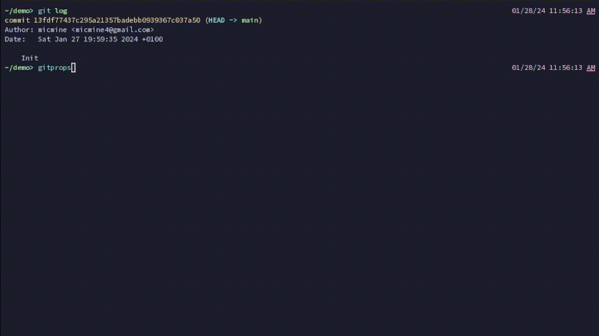

# gitprops

This is a tool to add "Co-authored-by" the last commit. In a TUI. That includes a search.

## Usage
keys = search

space = toggle author

esc/enter = exit UI and do "Co-authored-by" changes

arrow up/down = move the selected item

Ctrl-r: Remove all checkmarks

# Compatibility
- linux
- Windows 10
